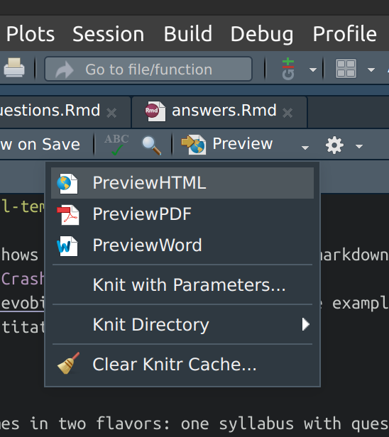
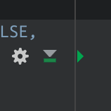
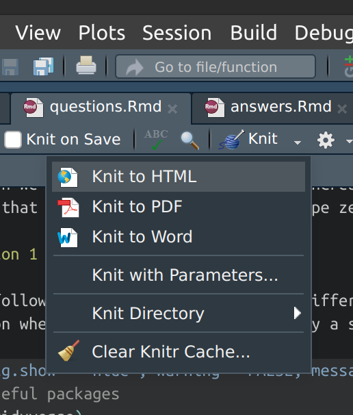

# evo-bio-cc-practical-template

This repository shows how to make a practical in Rmarkdown. It is made for the lecturers involved in the [Crash Course in Evolutionary Biology](https://evobiocrashcourse.github.io/). The example shown here is a practical about evolutionary quantitative genetics.

Check out the rest of my contributions to the Crash Course [here](https://github.com/rscherrer/evo-bio-cc).

### Prerequisites

-   [R](https://www.r-project.org/) (here 4.3.0)
-   [RStudio](https://posit.co/download/rstudio-desktop/) (recommended, here 2023.03.0)
-   Package [`rmarkdown`](https://rmarkdown.rstudio.com/) (here 2.21)
-   Package [`tidyverse`](https://www.tidyverse.org/) (for this specific practical, here 2.0.0)

### Instructions

The practical comes in two flavors: one syllabus with questions and one with answers. Both syllabuses are written in Rmarkdown, and are rendered into HTML by the R package `knitr`. How to build your own practical based on this template? Just download this repository and open the project `CC2023-practical-template.Rproj` in RStudio. From there, modify the `.Rmd` files as you see fit.

You can use the Preview button to view the result, like that:

Note that the Preview function will only show the output of the chunks that have been run manually, for example by clicking on the "play" button in each chunk:

The advantage of Preview is that it does not re-run all the chunks of R code in the document for rendering. Perfect when you are building your practical, but of course, at the end you want a final syllabus that evaluates all the code. To do that, you want to "knit" the document to HTML:

This will run all the R code in your practical, so it may take a while. Once the rendering is done, you will get an output `.html` page named after the source `.Rmd` file.

If you want to get more familiar with Rmarkdown I suggest you look up this [guide](https://rmarkdown.rstudio.com/lesson-1.html) and this [cheat sheet](https://www.rstudio.com/wp-content/uploads/2015/02/rmarkdown-cheatsheet.pdf). The [extended manual](https://bookdown.org/yihui/rmarkdown/) may also prove useful.

### Share with your students

Once your practical is ready, you can share `questions.html` with your students. They can then view all the questions in their browser, and copy and paste chunks of code into their own R console when needed. For best experience I recommend that for each practical they create a new [RStudio project](https://support.posit.co/hc/en-us/articles/200526207-Using-RStudio-Projects) and that they work within it, e.g. by creating a new script where they copy and paste the chunks of code that you will have given them in the exercise.

**Note:** Do not forget to share with your students any important files or folders that they might need for the practical. Here, for example, they will need to download the `functions/` folder into their working directory.

So here, the "package" to share would be:

-   `questions.html`
-   `functions/`

and maybe a `README` telling them what to do with those files.

You can of course share with them the `answers.html` after the practical has been completed.
